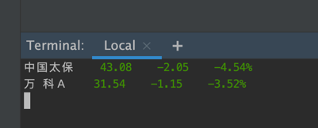

# watch
watch stock price 

# run 
``
java -jar watch-1.0-SNAPSHOT.jar sh601601 sz000002 sh600031
``


and now support a conf:
``
java -jar watch-1.0-SNAPSHOT.jar example.properties
``
and an example conf is:
```
# stocks examples
stocks=sh601601,sz000002

# the time to refresh
refreshIntervalInMills=1000

```